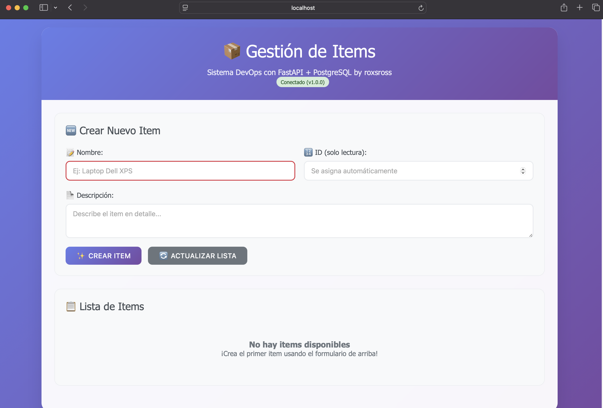
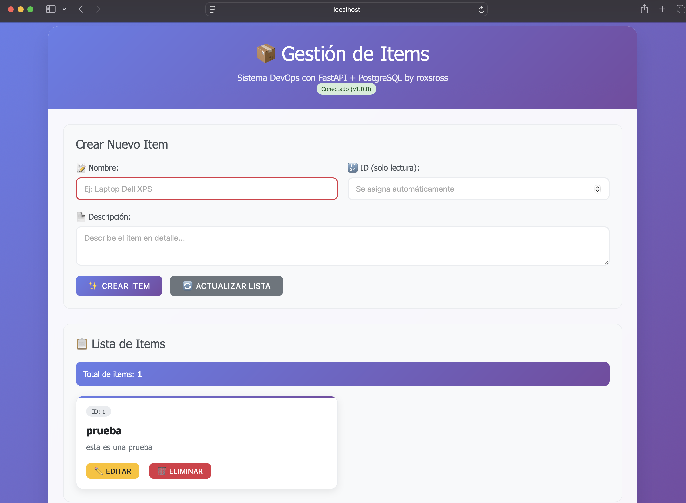
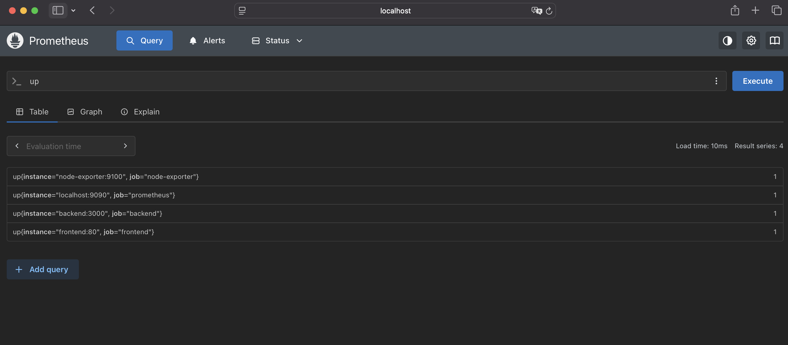
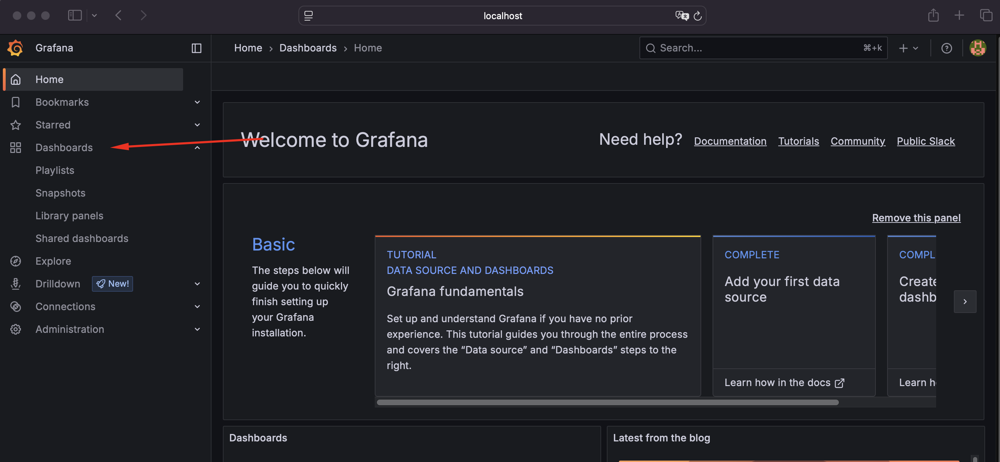
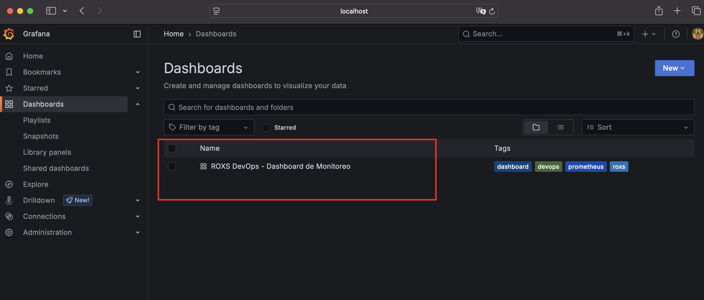
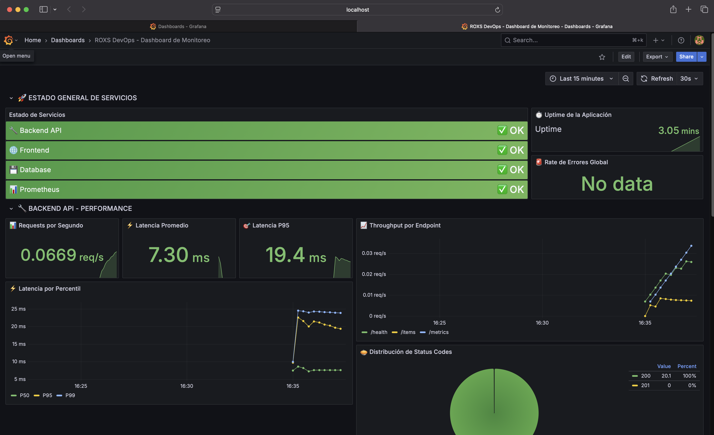
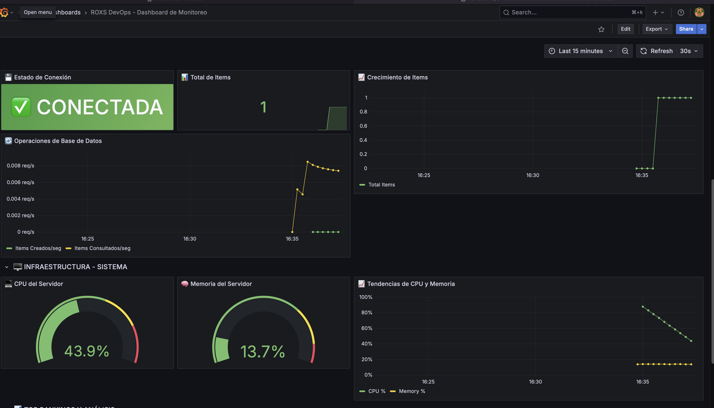

# 🚀 DevOps Laboratorio con implementación en Google Cloud


[](https://docker.com)
[](https://fastapi.tiangolo.com/)
[](https://postgresql.org)
[](https://prometheus.io)
[](https://grafana.com)

> **Proyecto educativo de DevOps** creado para aprender conceptos fundamentales de desarrollo, contenedores, orquestación y monitoreo.


## 📸 Screenshots del Ecosistema

<div align="center">

| 📦 Aplicación Principal | 📋 Gestión de Items | 📊 Prometheus Metrics | 🏠 Grafana Home |
|:---:|:---:|:---:|:---:|
|  |  |  |  |
| *Sistema de gestión de items con FastAPI + PostgreSQL* | *CRUD completo con items creados y funcionalidad de edición* | *Métricas de servicios en Prometheus* | *Panel de bienvenida de Grafana* |

| 📋 Dashboard List | 🚀 Dashboard Principal | 💾 Monitoreo Completo | 🐳 Docker Containers |
|:---:|:---:|:---:|:---:|
|  |  |  |  |
| *Lista de dashboards disponibles en Grafana* | *Dashboard principal con métricas de performance* | *Vista completa del monitoreo de DB e infraestructura* | *Stack completo ejecutándose en Docker* |

</div>

## 📋 Tabla de Contenidos

- [Descripción](#-descripción)
- [Arquitectura](#-arquitectura)
- [Requisitos](#-requisitos)
- [Instalación Rápida](#-instalación-rápida)
- [Uso](#-uso)
- [Monitoreo](#-monitoreo)
- [API Documentation](#-api-documentation)
- [Estructura del Proyecto](#-estructura-del-proyecto)
- [Tecnologías](#-tecnologías)
- [Troubleshooting](#-troubleshooting)
- [Contribuir](#-contribuir)

## 🎯 Descripción

Esta es una **aplicación fullstack de gestión de items** diseñada específicamente para **aprender DevOps**. Incluye:

- **Backend**: API REST con FastAPI y PostgreSQL
- **Frontend**: Interfaz web moderna con JavaScript vanilla
- **Contenedores**: Todo dockerizado para facilitar el despliegue
- **Monitoreo**: Stack completo con Prometheus y Grafana
- **Métricas**: Instrumentación completa de la aplicación
- **Automatización**: Makefile con comandos útiles

### ✨ Características Principales

- ✅ **CRUD completo** de items (Crear, Leer, Actualizar, Eliminar)
- ✅ **Interfaz responsiva** y moderna
- ✅ **API documentada** automáticamente con Swagger/OpenAPI
- ✅ **Base de datos persistente** con PostgreSQL
- ✅ **Monitoreo en tiempo real** con métricas personalizadas
- ✅ **Dashboards visuales** con Grafana
- ✅ **Health checks** y status de servicios
- ✅ **Logs estructurados** para debugging
- ✅ **Fácil escalabilidad** horizontal

## 🏗️ Arquitectura

```
┌─────────────────────────────────────────────────────────┐
│                    ARQUITECTURA DEL SISTEMA             │
├─────────────────────────────────────────────────────────┤
│                                                         │
│  ┌─────────────┐    ┌─────────────┐    ┌─────────────┐  │
│  │   Frontend  │────│   Backend   │────│  PostgreSQL │  │
│  │   (Nginx)   │    │  (FastAPI)  │    │     DB      │  │
│  │   Port 80   │    │  Port 3000  │    │  Port 5432  │  │
│  └─────────────┘    └─────────────┘    └─────────────┘  │
│         │                   │                           │
│         │                   │                           │
│  ┌─────────────────────────────────────────────────────┐│
│  │              STACK DE MONITOREO                     ││
│  │                                                     ││
│  │  ┌─────────────┐    ┌─────────────┐    ┌─────────┐  ││
│  │  │   Grafana   │────│ Prometheus  │────│   Node  │  ││
│  │  │ Port 3001   │    │  Port 9090  │    │Exporter │  ││
│  │  └─────────────┘    └─────────────┘    │Port 9100│  ││
│  │                                        └─────────┘  ││
│  └─────────────────────────────────────────────────────┘│
│                                                         │
└─────────────────────────────────────────────────────────┘
```

### 🔄 Flujo de Datos

1. **Usuario** → Frontend (Nginx) → Backend (FastAPI) → PostgreSQL
2. **Métricas** → Prometheus recolecta datos del Backend y Node Exporter
3. **Visualización** → Grafana consulta Prometheus para mostrar dashboards

## 📋 Requisitos

### Requisitos Mínimos

- **Docker**: 27+ 
- **Docker Compose**: 2.34+
- **Make**: Para usar el Makefile (opcional)
- **Sistema**: Linux, macOS o Windows con WSL2

### Requisitos de Hardware

- **RAM**: 4GB mínimo (8GB recomendado)
- **Disco**: 5GB libres
- **CPU**: 2 cores mínimo

### Verificar Requisitos

```bash
# Verificar Docker
docker --version
docker compose --version

# Verificar Make (opcional)
make --version

# Verificar recursos disponibles
docker system df
```

## 🚀 Instalación Rápida

### Opción 1: Usando Makefile (Recomendado)

```bash
# 1. Clonar el repositorio
git clone https://github.com/roxsross/roxs-devops-stack
cd roxs-devops-stack

# 2. Preparar el entorno
make install

# 3. Levantar la aplicación
make up

# 4. Verificar que todo funciona
make health

# 5. Ver URLs disponibles
make urls
```

### Opción 2: Usando Docker Compose Directamente

```bash
# 1. Crear redes necesarias
docker network create devops-network
docker network create monitoring-network

# 2. Levantar la aplicación
docker-compose up -d

# 3. Verificar servicios
docker-compose ps
```

### 🎯 Todo en Uno

```bash
# Levantar aplicación + monitoreo completo
make all
```

## 🎮 Uso

### Comandos Principales

```bash
# Ver todos los comandos disponibles
make help

# Gestión de la aplicación
make up           # Levantar aplicación
make down         # Detener aplicación  
make restart      # Reiniciar aplicación
make logs         # Ver logs en tiempo real

# Monitoreo
make monitoring        # Levantar Prometheus + Grafana
make stop-monitoring   # Detener monitoreo
make monitoring-logs   # Ver logs del monitoreo

# Utilidades
make health       # Verificar salud de servicios
make status       # Ver estado de contenedores
make test         # Ejecutar tests básicos
make backup       # Backup de la base de datos
```

### 🌐 URLs de Acceso

Después de ejecutar `make up` y `make monitoring`:

| Servicio | URL | Credenciales |
|----------|-----|--------------|
| **Frontend** | http://localhost | - |
| **Backend API** | http://localhost:3000 | - |
| **API Docs** | http://localhost:3000/docs | - |
| **Prometheus** | http://localhost:9090 | - |
| **Grafana** | http://localhost:3001 | admin/admin |

### 📱 Usando la Aplicación

1. **Accede al Frontend**: http://localhost
2. **Crea tu primer item**:
   - Nombre: "Mi primer item"
   - Descripción: "Esta es una prueba"
   - Haz clic en "Crear Item"
3. **Ve la lista actualizada** automáticamente
4. **Edita o elimina items** usando los botones de cada card

## 📊 Monitoreo

### Dashboard de Grafana

El dashboard incluye:

- **🚀 Estado General**: Status de todos los servicios
- **🔧 Performance del Backend**: RPS, latencia, errores
- **💾 Base de Datos**: Conexiones, total de items
- **🖥️ Infraestructura**: CPU, memoria del servidor
- **📈 Rankings**: Top endpoints, errores más frecuentes

### Métricas Disponibles

| Métrica | Descripción |
|---------|-------------|
| `http_requests_total` | Total de requests HTTP |
| `http_request_duration_seconds` | Latencia de requests |
| `database_items_total` | Total de items en BD |
| `database_status` | Estado de conexión a BD |
| `app_uptime_seconds` | Tiempo de actividad |

### Alertas Configuradas

- ❌ Servicio caído
- ⚠️ Latencia > 500ms
- 🚨 Error rate > 5%
- 💾 BD desconectada

## 📚 API Documentation

### Endpoints Principales

| Método | Endpoint | Descripción |
|--------|----------|-------------|
| `GET` | `/` | Información de la API |
| `GET` | `/health` | Health check |
| `GET` | `/metrics` | Métricas de Prometheus |
| `GET` | `/items` | Listar todos los items |
| `POST` | `/items` | Crear nuevo item |
| `GET` | `/items/{id}` | Obtener item por ID |
| `PUT` | `/items/{id}` | Actualizar item |
| `DELETE` | `/items/{id}` | Eliminar item |

### Ejemplos de Uso

```bash
# Listar items
curl http://localhost:3000/items

# Crear item
curl -X POST http://localhost:3000/items \
  -H "Content-Type: application/json" \
  -d '{"name": "Laptop", "description": "MacBook Pro 16"}'

# Health check
curl http://localhost:3000/health
```

### Documentación Interactiva

Visita http://localhost:3000/docs para explorar la API de forma interactiva con Swagger UI.

## 📁 Estructura del Proyecto

```
.
├── app/
│   ├── backend/                 # Backend FastAPI
│   │   ├── Dockerfile          # Imagen del backend
│   │   ├── main.py             # Aplicación principal
│   │   └── requirements.txt    # Dependencias Python
│   └── frontend/               # Frontend estático
│       ├── css/
│       │   └── styles.css      # Estilos CSS
│       ├── js/
│       │   ├── app.js          # Lógica principal
│       │   └── config.js       # Configuración
│       ├── index.html          # Página principal
│       ├── default.conf        # Configuración Nginx
│       └── Dockerfile          # Imagen del frontend
├── monitoring/                 # Stack de monitoreo
│   ├── grafana/
│   │   ├── dashboards/
│   │   │   └── simple-dashboard.json
│   │   └── provisioning/
│   │       ├── dashboards/
│   │       │   └── dashboards.yml
│   │       └── datasources/
│   │           └── datasources.yml
│   └── prometheus/
│       └── prometheus.yml      # Configuración Prometheus
├── Terraform/                  # Infraestructura como código (Terraform)
│   ├── main.tf                 # Definición principal de recursos
│   ├── startup.sh              # Script de inicialización
│   └── terraform.tfstate       # Estado de Terraform
├── docker-compose.yml          # Aplicación principal
├── docker-compose.monitoring.yml # Stack de monitoreo
├── Makefile                    # Comandos automatizados
└── README.md                   # Esta documentación
```

## 🛠️ Tecnologías

### Backend
- **FastAPI**: Framework web moderno y rápido
- **SQLAlchemy**: ORM para Python
- **PostgreSQL**: Base de datos relacional
- **Prometheus Client**: Métricas y monitoreo
- **Uvicorn**: Servidor ASGI

### Frontend
- **HTML5/CSS3**: Estructura y estilos
- **JavaScript ES6+**: Lógica del cliente
- **Nginx**: Servidor web estático

### DevOps
- **Docker**: Contenedores
- **Docker Compose**: Orquestación
- **Prometheus**: Recolección de métricas
- **Grafana**: Visualización de datos
- **Node Exporter**: Métricas del sistema

### Características DevOps
- **Multi-stage builds**: Optimización de imágenes
- **Health checks**: Verificación de servicios
- **Logging estructurado**: Para troubleshooting
- **Configuración por variables**: 12-factor app
- **Persistencia de datos**: Volúmenes Docker

## 🔧 Troubleshooting

### Problemas Comunes

#### ❌ Error: "network not found"
```bash
# Solución: Crear las redes manualmente
make install
# o
docker network create devops-network
docker network create monitoring-network
```

#### ❌ Error: "port already in use"
```bash
# Ver qué proceso usa el puerto
sudo lsof -i :80
sudo lsof -i :3000

# Cambiar puertos en variables de entorno
export FRONTEND_PORT=8080
export BACKEND_PORT=3001
make up
```

#### ❌ Backend no conecta a la BD
```bash
# Verificar logs de la BD
make logs-db

# Verificar logs del backend
make logs-backend

# Reiniciar servicios
make restart
```

#### ❌ Grafana no muestra datos
```bash
# Verificar que Prometheus esté activo
curl http://localhost:9090

# Verificar métricas del backend
curl http://localhost:3000/metrics

# Reiniciar monitoreo
make stop-monitoring
make monitoring
```

### Comandos de Diagnóstico

```bash
# Estado general
make status
make health

# Logs específicos
make logs-backend
make logs-frontend  
make logs-db

# Información del sistema
make info

# Test de conectividad
make test
```

### Limpiar y Reiniciar

```bash
# Limpiar recursos
make clean

# Limpiar todo (incluyendo imágenes)
make clean-all

# Reconstruir desde cero
make clean
make build
make up
```

## 🤝 Contribuir

### Para Contribuir

1. **Fork** el repositorio
2. **Crea** una rama para tu feature (`git checkout -b feature/nueva-funcionalidad`)
3. **Commit** tus cambios (`git commit -am 'Agregar nueva funcionalidad'`)
4. **Push** a la rama (`git push origin feature/nueva-funcionalidad`)
5. **Crea** un Pull Request

### Desarrollo Local

```bash
# Modo desarrollo (rebuild automático)
make dev

# Acceder a contenedores
make exec-backend
make exec-frontend
make exec-db
```


✅ Despliegue Local - Ya completado con Docker Compose

## 📋 TODO List - Próximos Pasos

### 🔄 CI/CD Pipeline
- [ ] GitHub Actions 
- [ ] Security Scanning
- [ ] Automated Deployment
- [ ] Rollback Strategy

### ☸️ Kubernetes Deployment
- [ ] Helm Charts
- [ ] Kubernetes Manifests
- [ ] Persistent Volumes

### 🔄 ArgoCD - GitOps
- [ ] ArgoCD Setup
- [ ] Application Sets
- [ ] GitOps Workflow

### 🔧 Tooling & Automation
- [ ] Terraform Modules
- [ ] Dashboard as Cod
- [ ] Metric Discovery
- [ ] Performance Testing
- [ ] Chaos Engineering

... y Mucho más 

## 📖 Recursos Adicionales

### Documentación
- [Docker Documentation](https://docs.docker.com/)
- [FastAPI Documentation](https://fastapi.tiangolo.com/)
- [Prometheus Documentation](https://prometheus.io/docs/)
- [Grafana Documentation](https://grafana.com/docs/)

### Tutoriales DevOps
- [Docker para Principiantes](https://docs.docker.com/get-started/workshop/)
- [Prometheus Tutorial](https://prometheus.io/docs/prometheus/latest/getting_started/)
- [Grafana Fundamentals](https://grafana.com/tutorials/grafana-fundamentals/)

## 📄 Licencia

Este proyecto está licenciado bajo MIT License - ver el archivo [LICENSE](LICENSE) para detalles.

## 👨‍💻 Autor

**Instructor DevOps y Cloud**

- 🐦 Twitter: [@roxsross](https://twitter.com/roxsross)
- 🔗 LinkedIn: [roxsross](https://linkedin.com/in/roxsross)
- ☕ Ko-fi [roxsross](https://ko-fi.com/roxsross)
- ▶️ Youtube [295devops](https://www.youtube.com/@295devops)
- 📧 Email: roxs@295devops.com

---

⭐ **¡Dale una estrella si este proyecto te ayudó!** ⭐

> 💡 **Tip**: Este proyecto está diseñado para fines educativos. Úsalo para aprender DevOps, contenedores, y monitoreo.